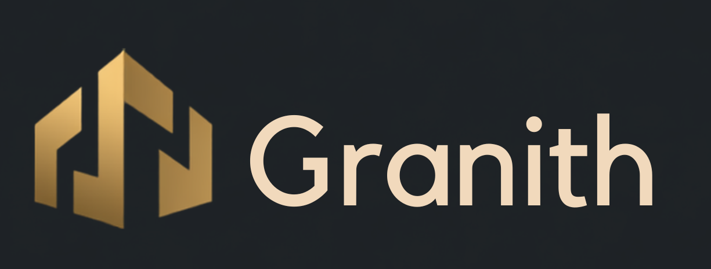

<p align="center">
  
</p>


<p align="center">
  <a href="https://github.com/DEV-W-NK/Granith-ERP/actions/workflows/firebase-hosting.yml">
    
  </a>
  <a href="https://granith-skyforge.web.app/">
    
  </a>
  
  
</p>

<p align="center">
  
</p>

<p align="center">
  <a href="#produto">Produto</a> |
  <a href="#cobertura-atual">Cobertura</a> |
  <a href="#destaques-tecnicos">Stack</a> |
  <a href="#integracao-erp--mobile">Mobile</a> |
  <a href="#firebase-hosting-e-cicd">CI/CD</a> |
  <a href="#estado-do-produto">Status</a>
</p>

---

# Granith ERP

ERP web vertical para construtoras, obras e operacoes de campo. O Granith centraliza o fluxo entre comercial, projetos, medicoes, requisicoes, compras, estoque, financeiro, RH, frota, clientes, relatorios e mobile.

> Status: beta avancado com fluxo ponta a ponta implementado. O sistema ja cobre a maior parte da operacao real de uma empresa de obras e esta pronto para demonstracao, validacao com usuarios e pilotos controlados. Para producao ampla, ainda exige hardening final de seguranca, RLS, infraestrutura e politicas operacionais.

```text
Deploy publico: https://granith-skyforge.web.app/
```

<table>
  <tr>
    <td><strong>Operacao</strong><br>Projetos, medicoes, diario, requisicoes e compras.</td>
    <td><strong>Financeiro</strong><br>Entradas, saidas, compras a pagar, DRE e custo de mao de obra.</td>
    <td><strong>Campo</strong><br>Geofence, rotas, notificacoes e app Android integrado.</td>
  </tr>
  <tr>
    <td><strong>Cliente</strong><br>Portal com obras, detalhes e medicoes aprovadas.</td>
    <td><strong>IA</strong><br>Assistentes por area via Edge Function protegida.</td>
    <td><strong>Entrega</strong><br>Firebase Hosting, GitHub Actions e testes automatizados.</td>
  </tr>
</table>

## Produto

O Granith ERP foi construido como uma base real de produto, nao apenas uma prova de conceito. A proposta e reduzir planilhas e controles isolados, criando uma linha operacional rastreavel:

```text
Orcamento aprovado
        |
        v
Projeto / Obra
        |
        v
Equipe, medicoes, diario, geofence e evidencias
        |
        v
Requisicao de material ou servico
        |
        v
Cotacao, compra, entrega e estoque
        |
        v
Contas a pagar, contas a receber e DRE
        |
        v
Portal do cliente, relatorios e indicadores
```

## Cobertura Atual

| Area | Cobertura |
| --- | --- |
| Comercial | Orcamentos, tipos de orcamento, propostas, clientes e origem do projeto |
| Projetos | Obras, status, localizacao, progresso, custos, coordenador e equipe |
| Medicoes | Progresso fisico/financeiro, valores medidos e historico |
| Diario de obra | Registros de campo, rastreabilidade e base para evidencias |
| Requisicoes | Pedidos internos de materiais/servicos, status e integracao com compras |
| Compras | Fornecedores, itens, pedidos, cotacoes, entrega e reflexo financeiro |
| Estoque | Catalogo, saldos, entradas, baixas, transferencias e associacao por obra |
| Financeiro | Entradas/saidas, compras a pagar, DRE, ponto/custos e origem das transacoes |
| RH | Funcionarios, cargos, setores, beneficios, equipes e coordenadores |
| Frota/logistica | Veiculos, motoristas, coletas, entregas, rotas e quilometragem |
| Geofencing | Cercas por obra, base para validacao de ponto e presenca |
| Cliente | Portal com projetos, detalhes, medicoes aprovadas e documentos |
| Acessos | Usuarios internos, clientes, permissoes, convite e vinculos |
| IA | Assistentes por contexto via Edge Function, sem expor chave Gemini no web |
| Mobile | Integracao com app Android para campo, rotas, ponto, offline e notificacoes |

## Modulos Principais

- Dashboard operacional.
- Projetos e obras.
- Medicoes de obra.
- Diario de obra.
- Requisicoes de materiais.
- Orcamentos e tipos de orcamento.
- Compras, fornecedores e catalogo de itens.
- Estoque e movimentacoes.
- Entradas e saidas financeiras.
- Compras a pagar.
- Analise de ponto e custo de mao de obra por obra.
- DRE gerencial.
- RH, funcionarios, cargos, beneficios e equipes.
- Frota, veiculos, rotas, coletas e entregas.
- Geofencing de obras.
- Portal do cliente.
- Permissoes, usuarios internos e clientes.
- Configuracoes do workspace.
- Assistentes de IA por area.

## Destaques Tecnicos

| Camada | Tecnologia |
| --- | --- |
| UI | Flutter Web responsivo |
| Estado | Provider/ChangeNotifier e Riverpod em pontos especificos |
| Backend | Supabase Postgres, Auth, Storage, Realtime e PostgREST |
| Edge Functions | Supabase Functions em Deno |
| Auth | Supabase Auth, OAuth Google e usuarios internos |
| Banco | Migrations versionadas |
| Mapas | Google Maps e geocoding |
| Graficos | fl_chart |
| Deploy | Firebase Hosting |
| CI/CD | GitHub Actions |
| Testes | flutter_test para models, services, controllers, viewmodels e widgets |

## Arquitetura

```text
lib/
  app/           bootstrap, providers globais e roteamento
  controllers/   estado e regras de tela
  core/          configuracoes, infraestrutura e utilitarios
  features/      modulos novos organizados por feature
  models/        entidades e serializacao
  screens/       paginas principais
  services/      Supabase, OAuth, Maps e integracoes
  themes/        identidade visual
  widgets/       views e componentes por modulo

supabase/
  functions/     Edge Functions server-side
  migrations/    evolucao do banco
  templates/     templates auxiliares

test/            cobertura automatizada
docs/            auditorias e guias tecnicos
```

## Integracao ERP + Mobile

O ERP e a fonte principal de cadastro, aprovacao, analise e gestao. O app mobile coleta dados de campo e sincroniza com o mesmo banco:

| ERP Web | Mobile Android |
| --- | --- |
| Cadastra projetos, equipes, obras e coordenadores | Exibe obras/equipes vinculadas ao funcionario |
| Planeja rotas e coletas/entregas | Motorista executa rota, checkpoints e tracking |
| Define cercas e regras de ponto | Funcionario bate ponto validado por geofence |
| Controla requisicoes e compras | Funcionario solicita material e acompanha status |
| Consolida financeiro e DRE | Mobile envia eventos de campo e evidencias |
| Gerencia notificacoes | App recebe push e sincroniza dados locais |

## Seguranca

Base atual:

- Autenticacao Supabase.
- Separacao entre admin, funcionario e cliente.
- Usuarios internos sem depender apenas de Google.
- Permissoes por codigo e escopo.
- RLS versionado em migrations.
- Edge Functions para acoes sensiveis.
- Firebase/Gemini protegidos por backend quando necessario.
- `.env.local`, service accounts, keystores e secrets fora do Git.
- Historico higienizado para repositorio publico.

Antes de producao ampla:

- Revisar politicas RLS por cada perfil.
- Validar buckets privados e URLs assinadas.
- Configurar SMTP proprio para convites.
- Definir politicas de backup, logs e auditoria.
- Revisar limites, quotas e observabilidade.

## IA e Gemini

O Flutter Web nao recebe `GEMINI_API_KEY`. O fluxo correto e:

```text
Flutter Web -> Supabase Edge Function -> Gemini API
```

A Edge Function valida sessao, modelo permitido, payload e limite de tokens.

Comandos comuns:

```powershell
npx supabase secrets set GEMINI_API_KEY="SUA_CHAVE"
npx supabase secrets set GEMINI_MODEL="gemini-2.5-flash"
npx supabase secrets set GEMINI_ALLOWED_MODELS="gemini-2.5-flash"
npx supabase secrets set GEMINI_MAX_OUTPUT_TOKENS="1200"
npx supabase functions deploy gemini_generate
```

## Firebase Hosting e CI/CD

Workflow:

```text
.github/workflows/firebase-hosting.yml
```

Comportamento:

| Evento | Acao |
| --- | --- |
| Pull request para `main` | `pub get`, `analyze`, `test`, `build web` e preview quando secrets existem |
| Push na `main` | Validacao, build e deploy live no Firebase Hosting |
| `workflow_dispatch` | Deploy manual |

Secrets esperados no GitHub Actions:

```text
SUPABASE_URL
SUPABASE_PUBLISHABLE_KEY
GOOGLE_MAPS_API_KEY
GOOGLE_OAUTH_WEB_CLIENT_ID
FIREBASE_SERVICE_ACCOUNT_GRANITH_SKYFORGE
```

Nao colocar no build web:

```text
SUPABASE_SERVICE_ROLE_KEY
GOOGLE_OAUTH_CLIENT_SECRET
GEMINI_API_KEY
```

Essas chaves sao server-side.

## Ambiente Local

Requisitos:

- Flutter stable.
- Chrome.
- Supabase CLI ou `npx supabase`.
- Node/npm para ferramentas auxiliares.
- JDK/Android SDK se for gerar builds mobile relacionados.

Instalacao:

```powershell
flutter pub get
Copy-Item .env.example .env.local
Copy-Item supabase/.env.example supabase/.env.local
```

Rodar web local:

```powershell
.\scripts\run_dev.ps1 -CheckOnly
.\scripts\run_dev.ps1 -Device chrome
```

Rodar em porta fixa:

```powershell
.\scripts\run_dev.ps1 -Device chrome --web-port 65350
```

## Variaveis Locais

| Variavel | Uso |
| --- | --- |
| `SUPABASE_URL` | URL do projeto Supabase |
| `SUPABASE_PUBLISHABLE_KEY` | Chave publica/anon do Supabase |
| `GOOGLE_MAPS_API_KEY` | Google Maps e geocoding |
| `GOOGLE_OAUTH_WEB_CLIENT_ID` | OAuth Google Web |
| `GOOGLE_OAUTH_ANDROID_CLIENT_ID` | OAuth Google Android |
| `GOOGLE_OAUTH_IOS_CLIENT_ID` | OAuth Google iOS |
| `GOOGLE_OAUTH_IOS_REVERSED_CLIENT_ID` | URL scheme iOS |
| `GOOGLE_OAUTH_CLIENT_SECRET` | Apenas local/Supabase, nunca no Flutter Web |
| `GOOGLE_OAUTH_REDIRECT_URL` | Redirect local de OAuth |
| `GEMINI_MODEL` | Modelo solicitado ao backend |
| `GRANITH_ANIMATE_WEB_BACKDROP` | Alterna fundo animado no web |

## Supabase

Migrations:

```text
supabase/migrations
```

Functions:

```text
supabase/functions
```

Comandos:

```powershell
npx supabase login
npx supabase link --project-ref SEU_PROJECT_REF
npx supabase db push
npx supabase functions deploy dispatch_mobile_push
npx supabase functions deploy manage_internal_user
npx supabase functions deploy gemini_generate
```

Secrets server-side ficam em Supabase Secrets, nunca no Flutter Web.

## Testes

```powershell
flutter analyze --no-fatal-infos --no-fatal-warnings
flutter test
flutter build web --release `
  --dart-define=SUPABASE_URL="https://example.supabase.co" `
  --dart-define=SUPABASE_PUBLISHABLE_KEY="placeholder" `
  --dart-define=GOOGLE_MAPS_API_KEY="" `
  --dart-define=GOOGLE_OAUTH_WEB_CLIENT_ID=""
```

## Estado do Produto

O Granith ERP esta praticamente completo como base funcional de ERP vertical:

- possui fluxo operacional de ponta a ponta;
- possui UI responsiva e identidade visual propria;
- possui integracao com banco real e migrations;
- possui CI/CD e deploy publico;
- possui app mobile complementar;
- possui testes automatizados em areas criticas;
- possui arquitetura preparada para evolucao modular.

O que falta antes de producao comercial ampla e menos "feature" e mais maturidade operacional: seguranca fina, observabilidade, backup, auditoria, homologacao de regras fiscais/trabalhistas e validacao com usuarios reais.

## Roadmap

1. Hardening final de RLS, storage e auditoria.
2. Refinamento do fluxo compras -> financeiro -> estoque por obra.
3. Dashboards executivos mais enxutos.
4. Notificacoes entre ERP e Mobile em eventos criticos.
5. Relatorios PDF por obra, coordenador e mao de obra.
6. Polimento final de UX em telas densas.
7. Piloto controlado com dados reais.

## Licenca

Projeto em desenvolvimento ativo. Antes de uso comercial, revise licenciamento, credenciais, termos de terceiros e politicas de dados.
