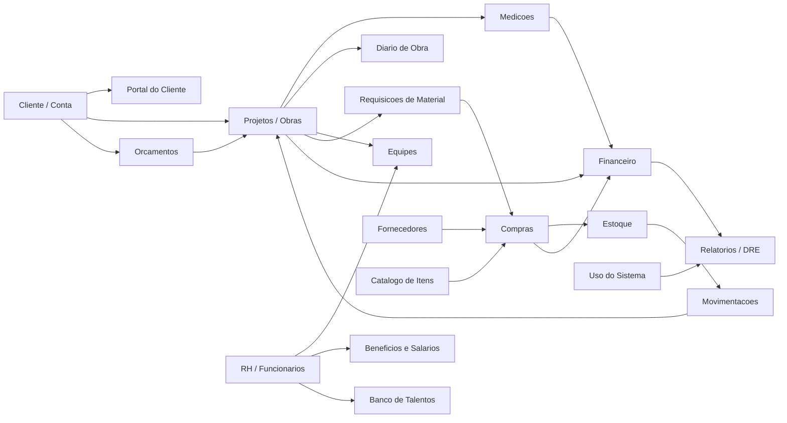
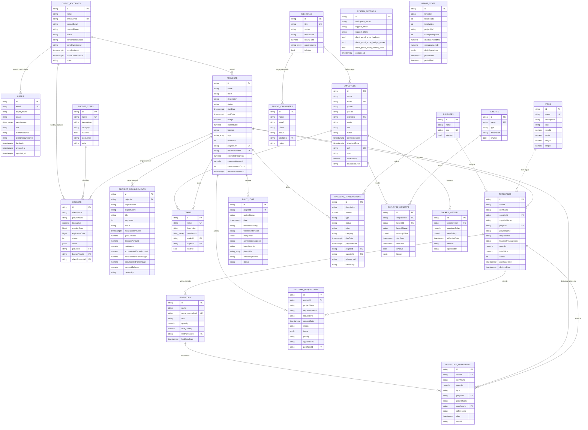

# Modelo de Dados - Granith ERP

Este levantamento usa como fonte principal `supabase_schema.sql` e considera o estado atual do app em Flutter. A fonte de verdade e o Supabase. O app nao usa mais Firestore para dados operacionais; Firebase permanece apenas para Hosting.

## Contexto de Dados

| Modulo | Entidades principais | Backend lido hoje |
| --- | --- | --- |
| Acesso e portal | `users`, `client_accounts`, `system_settings` | Supabase |
| Comercial | `budget_types`, `budgets`, `projects`, `project_measurements` | Supabase |
| Obras | `projects`, `daily_logs`, `teams`, `employees` | Supabase |
| Suprimentos | `items`, `suppliers`, `purchases`, `inventory`, `inventory_movements`, `material_requisitions` | Supabase |
| RH | `employees`, `job_roles`, `benefits`, `employee_benefits`, `salary_history`, `talent_candidates` | Supabase |
| Financeiro | `financial_transactions`, `project_measurements`, `usage_stats` | Supabase |

## MER Conceitual

## DER Mermaid

## Regras de Integridade Relevantes

- `projects.status`: `planning`, `inProgress`, `completed`.
- `budgets.status`: inteiro `0..3` (`pending`, `approved`, `rejected`, `expired`).
- `purchases.status`: inteiro `0..4` (`awaitingApproval`, `pending`, `ordered`, `delivered`, `cancelled`).
- `material_requisitions.status`: `pending`, `approved`, `rejected`, `purchased`, `delivered`.
- `financial_transactions`: toda movimentacao deve ter `type`, `origin`, `category`, `dueDate` e, quando aplicavel, `projectId`, `supplierId` e `referenceId`.
- `project_measurements` recalcula progresso medido, saldo contratual e acumulados do projeto.
- `employee_benefits` e `salary_history` preservam historico operacional de RH; reajustes devem ser append-only.

## Observacoes Para Migracao

- `suppliers`, `purchases`, `inventory`, `inventory_movements`, `material_requisitions`, `daily_logs`, `financial_transactions`, `benefits`, `employee_benefits` e `salary_history` sao lidos e gravados pelo app via Supabase.
- O seeder atualizado popula apenas o Supabase.
- `auth.users` do Supabase nao e criado pelo seeder do app. O seeder cria registros em `public.users` para gestao de acesso, mas contas reais de login continuam dependendo do Supabase Auth.
