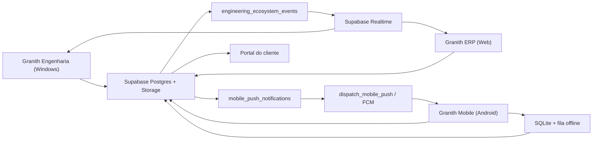

# P4 - Integracao do Ecossistema de Engenharia

O P4 conecta Granith Engenharia, ERP Web, Mobile Android e portal do cliente
usando o mesmo projeto Supabase como fonte de verdade.

## Fluxo



## Entregas Tecnicas

1. O Engenharia cria uma entrega vinculada a uma obra.
2. A entrega recebe revisoes aprovadas e relatorios tecnicos aprovados.
3. `send_engineering_delivery` muda o estado para `sent`, gera evento e push.
4. O Mobile consulta `mobile_engineering_deliveries`.
5. O destinatario confirma o recebimento ou solicita revisao.
6. Sem rede, a operacao fica em `granith_engineering_deliveries.db`.
7. Na primeira conexao, `apply_engineering_offline_operation` aplica a acao
   usando uma chave idempotente.
8. ERP e Engenharia recebem o evento e atualizam a interface.

Estados:

```text
draft -> ready -> sent -> acknowledged
                        \-> revisionRequested
draft/ready/sent -> cancelled
```

## Relatorios Tecnicos

Os PDFs sao gerados no aplicativo Engenharia e enviados ao bucket privado
`engineering-reports`. Cada registro possui:

- obra e origem do calculo;
- tipo e versao;
- caminho privado, tamanho e MIME type;
- SHA-256;
- resumo e metadados da memoria de calculo;
- estado de revisao e publicacao;
- autor, revisor e timestamps.

Somente relatorios aprovados podem ser publicados. O portal consulta
`client_portal_engineering_reports` e recebe uma URL assinada temporaria.

## Documentos No Mobile

A view `mobile_engineering_documents` combina:

- revisoes de documentos aprovadas e publicadas;
- relatorios tecnicos aprovados e publicados.

O Mobile grava um resumo consultavel em SQLite junto dos demais documentos da
obra. O arquivo original continua privado no Storage e nao e transformado em
URL publica.

## Realtime E Refresh

O aplicativo Engenharia observa:

- `engineering_ecosystem_events`;
- notificacoes destinadas ao usuario.

O portal do cliente observa publicacoes de documentos, relatorios e eventos da
obra. As atualizacoes usam debounce para evitar varias consultas para uma unica
operacao transacional.

O Mobile usa push como gatilho de sincronizacao para os alvos:

```text
engineeringDeliveries
engineeringDocuments
engineeringReports
```

## Offline

Granith Engenharia:

- cache atomico do workspace em arquivo JSON;
- leitura do ultimo snapshot quando PostgREST estiver indisponivel;
- fila persistente para recebimentos e leitura de notificacoes;
- replay idempotente quando a conexao retornar.

Granith Mobile:

- cache SQLite das entregas;
- confirmacao e solicitacao de revisao offline;
- retry com backoff exponencial;
- sincronizacao ao iniciar, recuperar a rede, receber push ou voltar ao app;
- cache textual dos documentos aprovados da obra.

## Auditoria

`engineering_audit_events` registra INSERT, UPDATE e DELETE das entidades
tecnicas com:

- usuario, funcionario e e-mail;
- origem, request e correlation ID;
- valores anteriores e posteriores;
- tabela, operacao e timestamp.

`engineering_ecosystem_events` registra o evento de integracao. A
`correlationId` permite seguir uma operacao entre Engenharia, Postgres, ERP,
push e Mobile.

## Tabelas E Views

| Objeto | Responsabilidade |
| --- | --- |
| `engineering_technical_reports` | Versoes imutaveis dos PDFs tecnicos |
| `engineering_client_report_publications` | Publicacao/revogacao no portal |
| `engineering_delivery_reports` | Relatorios incluidos em uma entrega |
| `engineering_delivery_receipts` | Recebimento ou solicitacao de revisao |
| `engineering_ecosystem_events` | Realtime e trilha entre aplicativos |
| `engineering_offline_operations` | Idempotencia do replay offline |
| `mobile_engineering_deliveries` | Entregas visiveis para o Mobile |
| `mobile_engineering_documents` | Resumo offline de documentos aprovados |
| `client_portal_engineering_reports` | Relatorios liberados ao cliente |

## Implantacao

As migrations canonicas ficam no ERP. Aplique em ordem:

```powershell
cd D:\Projetos\Granith-ERP
npx supabase db push
npx supabase functions deploy dispatch_mobile_push
```

Depois, confirme:

```powershell
npx supabase migration list
npx supabase functions list
```

O Mobile e o Engenharia precisam apontar para o mesmo `SUPABASE_URL`. A
service role e as credenciais FCM permanecem apenas em Supabase Secrets.

## Validacao

```powershell
cd D:\Projetos\Granith-ERP
npx supabase test db

cd D:\Projetos\granith_engenharia
flutter analyze

cd D:\Desenvolvimento\Granith-Mobile
flutter analyze
```
