# Fluxo completo do ecossistema Granith

> Estado atual validado em 27/07/2026 nos projetos Granith ERP, Granith Mobile
> e nas migrations do Supabase. Este documento descreve o que o código faz
> hoje, e não apenas a arquitetura desejada.

## Como ler este documento

- **ERP Web:** cadastro, planejamento, aprovação, auditoria e gestão.
- **Mobile:** operação de campo, execução de rotas, ponto, evidências e trabalho
  offline.
- **Supabase:** fonte de verdade compartilhada, autenticação, RLS, Realtime,
  Storage e Edge Functions.
- **SQLite:** memória operacional do aparelho e filas para sincronização.
- **Firebase:** Hosting do ERP e entrega de notificações FCM ao Mobile.
- Uma seta contínua representa uma gravação ou dependência direta.
- Uma seta tracejada representa leitura, análise ou atualização derivada.

## 1. Mapa mestre

```mermaid
flowchart TB
  subgraph Pessoas["Pessoas e perfis"]
    ADM["Administrador"]
    GES["Gerente"]
    COO["Coordenador"]
    SUP["Supervisor"]
    FUN["Funcionário"]
    MOT["Motorista"]
    CLI["Cliente"]
  end

  subgraph Web["Granith ERP Web"]
    LOGIN_WEB["Login Google, e-mail ou usuário interno"]
    ERP_OP["Operacional<br/>Projetos, medições, diários, requisições e tarefas"]
    ERP_RH["RH<br/>Funcionários, cargos, equipes e benefícios"]
    ERP_COM["Comercial<br/>Orçamentos e tipos"]
    ERP_SUP["Suprimentos<br/>Itens, fornecedores, compras, rotas e estoque"]
    ERP_FIN["Financeiro<br/>Entradas, saídas, compras a pagar, ponto, DRE e resultado"]
    ERP_ADM["Administrativo<br/>Acessos, frota, cercas e configurações"]
    ERP_IA["IAs especializadas por módulo"]
    PORTAL["Portal do cliente"]
  end

  subgraph App["Granith Mobile Android"]
    LOGIN_APP["Login Google ou usuário interno"]
    APP_HOME["Workspace do funcionário"]
    APP_FIELD["Obras, tarefas, materiais, diário e medições"]
    APP_TIME["Ponto e geofence"]
    APP_ROUTE["Rotas, GPS, checkpoints e comprovantes"]
    APP_STOCK["Estoque, veículo e combustível"]
    APP_INFO["Equipe, benefícios, documentos e relatórios próprios"]
    APP_IA["Assistente local com flutter_gemma"]
    SQLITE["SQLite<br/>cache, documentos, notificações e outboxes"]
  end

  subgraph Backend["Supabase"]
    AUTH["Auth"]
    API["PostgREST e RPC"]
    DB[("PostgreSQL")]
    RLS["RLS, triggers e funções privadas"]
    REALTIME["Realtime"]
    STORAGE["Storage de imagens e evidências"]
    EDGE["Edge Functions"]
    PUSH_QUEUE[("mobile_push_notifications")]
  end

  subgraph Externos["Serviços externos"]
    MAPS["Google Maps e Routes API"]
    GEMINI["Gemini API"]
    FCM["Firebase Cloud Messaging"]
    HOSTING["Firebase Hosting"]
    HF["Hugging Face<br/>download do modelo"]
  end

  ADM --> LOGIN_WEB
  GES --> LOGIN_WEB
  COO --> LOGIN_WEB
  SUP --> LOGIN_WEB
  CLI --> LOGIN_WEB
  FUN --> LOGIN_APP
  MOT --> LOGIN_APP
  SUP --> LOGIN_APP
  COO --> LOGIN_APP

  LOGIN_WEB --> AUTH
  LOGIN_APP --> AUTH
  AUTH --> RLS
  RLS --> API
  API --> DB

  ERP_OP --> API
  ERP_RH --> API
  ERP_COM --> API
  ERP_SUP --> API
  ERP_FIN --> API
  ERP_ADM --> API
  PORTAL --> API
  ERP_OP --> STORAGE

  APP_HOME --> SQLITE
  APP_FIELD --> SQLITE
  APP_TIME --> SQLITE
  APP_ROUTE --> SQLITE
  APP_STOCK --> SQLITE
  APP_INFO --> SQLITE
  SQLITE <--> API
  REALTIME -. atualiza .-> ERP_OP
  REALTIME -. atualiza .-> APP_HOME

  APP_ROUTE --> MAPS
  ERP_ADM --> MAPS
  ERP_IA --> EDGE
  EDGE --> GEMINI
  APP_IA --> HF
  APP_IA --> SQLITE

  DB --> PUSH_QUEUE
  PUSH_QUEUE --> EDGE
  EDGE --> FCM
  FCM --> APP_HOME
  FCM -. solicita sync .-> SQLITE

  HOSTING --> LOGIN_WEB
```

### Resumo operacional

1. O usuário autentica no Supabase.
2. O perfil em `users` define se ele entra no ERP, Mobile ou Portal do Cliente.
3. O vínculo com `employees`, o cargo hierárquico e as permissões liberam os
   módulos.
4. ERP e Mobile gravam na mesma base, mas com responsabilidades diferentes.
5. Triggers do banco criam notificações quando mudanças relevantes precisam
   chegar ao campo.
6. O FCM acorda o Mobile e informa quais caches devem ser sincronizados.
7. Sem rede, o Mobile opera sobre SQLite e mantém alterações em filas locais.
8. Na primeira conexão disponível, as filas são enviadas ao Supabase.

## 2. Camadas e dependências técnicas

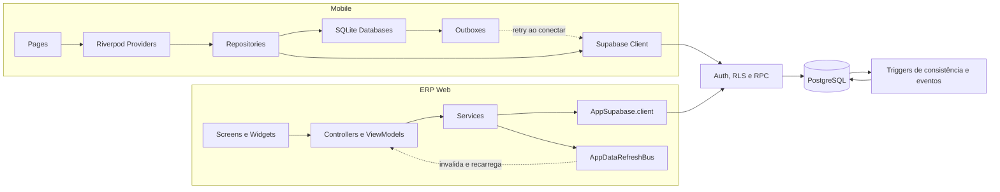

### O que “herda” o quê na arquitetura

| Origem | Herança/dependência | Efeito |
| --- | --- | --- |
| Tela do ERP | Controller/ViewModel e Service | A tela não deve acessar regra de banco diretamente. |
| Service do ERP | `AppSupabase.client` | Centraliza as operações remotas. |
| Escrita do ERP | `AppDataRefreshBus` | As listas relacionadas são recarregadas após salvar. |
| Tela Mobile | Provider e Repository | A interface recebe estado local/remoto pelo Riverpod. |
| Repository Mobile | SQLite + Supabase | Lê cache primeiro e sincroniza quando possível. |
| Qualquer escrita autenticada | RLS/RPC | O banco valida identidade, papel e permissão. |
| Mudança operacional relevante | Trigger de notificação | Uma linha é criada na fila de push. |

## 3. Identidade, vínculo e permissões

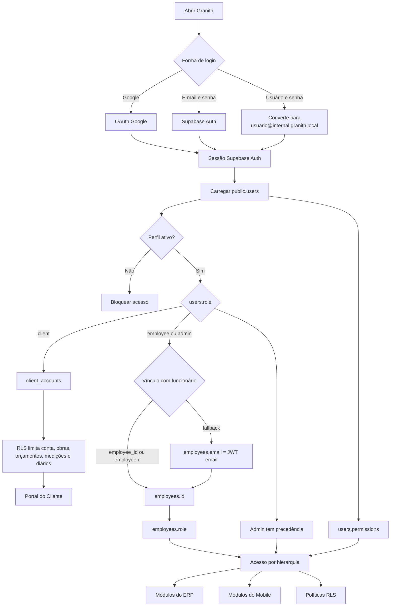

### Hierarquia efetiva do funcionário

| Nível | Papel persistido | Herda acesso do nível anterior | Capacidades Mobile principais |
| ---: | --- | --- | --- |
| 1 | `funcionario` | Base | Obras vinculadas, ponto, equipe, documentos, benefícios próprios, tarefas atribuídas e veículo quando permitido. |
| 2 | `supervisor` | Funcionário | Requisitar material, diário, equipe, medições, estoque e criação de tarefas sob sua supervisão. |
| 3 | `coordenador` | Supervisor | Hierarquia Mobile, horas externas, visão e gestão ampliadas, tarefas relacionadas. |
| 4 | `gerente` | Coordenador | Resumo executivo e visão gerencial. |
| 5 | `admin` em `users` | Todos | Bypass administrativo previsto pelas funções privadas e permissões globais. |

Permissões específicas podem liberar módulos como `manualWorkHours`,
`fuelLogsWrite`, `deliveryRoutesUse`, `inventoryOperate`,
`vehicleChecklistWrite`, `measurementsEvidenceWrite`,
`executiveBriefRead` e `offlineAssistantUse`, mesmo quando o setor ou cargo
normal não liberaria a função.

## 4. Dependência funcional entre módulos

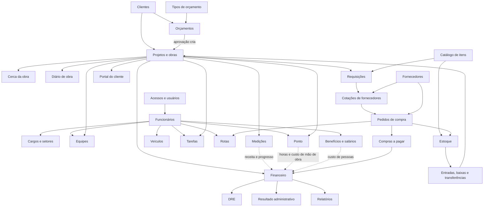

## 5. Ciclo de vida de uma obra

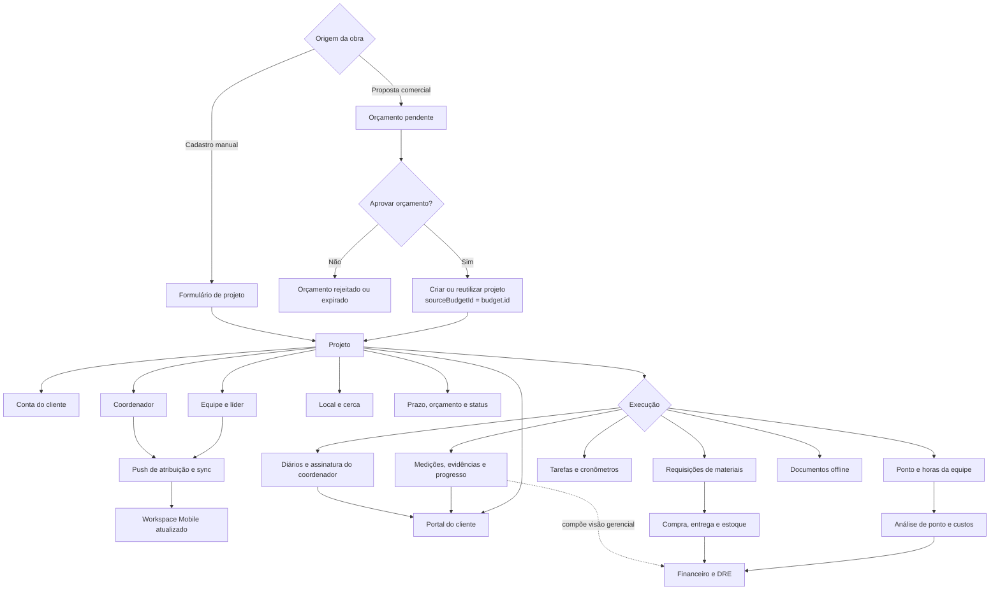

### Dados herdados pela obra

| Origem | Dados que chegam ao projeto | Observação |
| --- | --- | --- |
| Orçamento aprovado | Nome, cliente, descrição, valor, prazo, conta do cliente e `sourceBudgetId` | A aprovação cria o projeto automaticamente se ainda não existir. |
| Formulário de projeto | Dados completos e coordenador selecionado | A exigência do coordenador está principalmente na interface. |
| Conta do cliente | Identificação usada pelo Portal do Cliente e RLS | O cliente vê apenas projetos vinculados à sua conta. |
| Coordenador | `coordinatorId` e nome denormalizado | A troca gera push e pedido de sincronização. |
| Equipe | `teams.projectId`, líder e membros | A equipe herda a obra; a obra não armazena todos os membros diretamente. |
| Cerca | Latitude, longitude e lado em metros | O Mobile baixa a cerca das obras atribuídas. |

## 6. Requisição, cotação, compra, financeiro e estoque

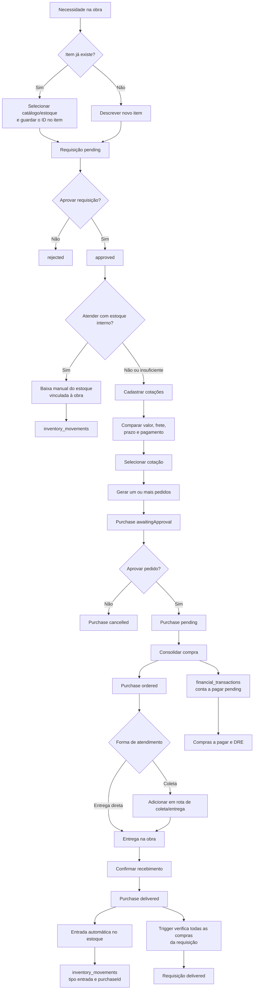

### O que é automático neste fluxo

| Transição | Tipo atual |
| --- | --- |
| Cotação selecionada → pedido aguardando aprovação | Ação explícita no ERP. |
| Aprovação do pedido → `pending` | Ação explícita no ERP. |
| Consolidação → `ordered` + conta a pagar | Ação explícita; a conta financeira é criada pelo service. |
| Confirmação da entrega → estoque + movimento | Ação explícita; os lançamentos são automáticos após confirmar. |
| Compra entregue → requisição entregue | Trigger automático no banco quando todas as compras vinculadas fecharam. |
| Estoque existente → baixa para obra | Manual; atualmente não há reserva nem fechamento automático da requisição. |

## 7. Planejamento e execução de rotas

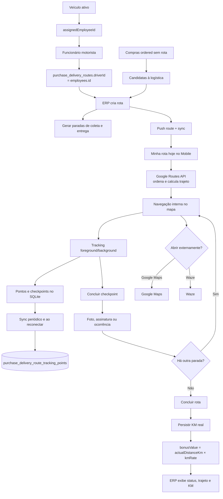

O ERP planeja e acompanha; o motorista executa no Mobile. Motoristas elegíveis
são funcionários vinculados a veículos ativos, não registros de texto livres.

## 8. Ponto, geofence e custo de mão de obra

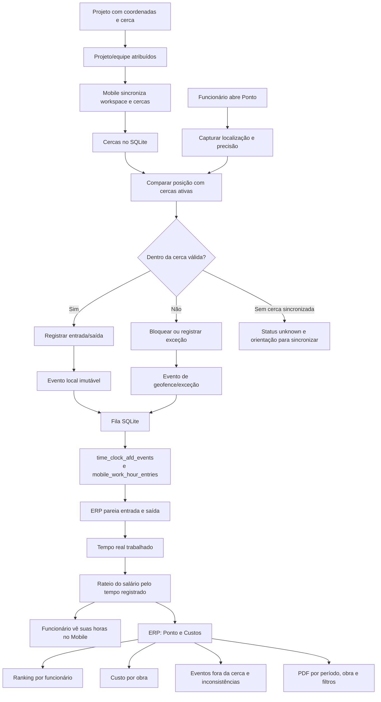

O cálculo usa as horas efetivamente pareadas no período. Não presume uma carga
fixa de 220 horas, evitando distorções com férias, feriados e afastamentos.

## 9. Tarefas compartilhadas

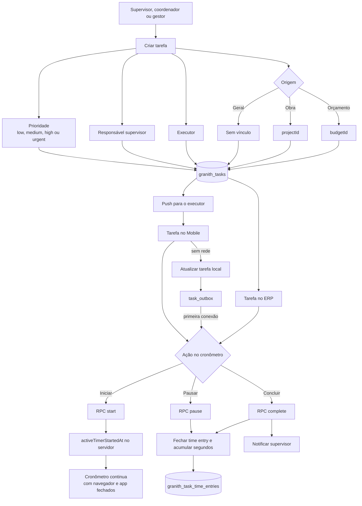

Regras centrais:

- apenas uma tarefa pode ter cronômetro ativo por executor;
- apenas uma entrada de tempo pode permanecer aberta por tarefa;
- o tempo é calculado por timestamp do servidor, não por um `Timer` local;
- o executor controla o cronômetro;
- supervisores e níveis superiores criam/gerenciam tarefas conforme RLS;
- ações offline usam o horário ocorrido no aparelho, limitado pelo RPC a uma
  janela segura de sete dias.

## 10. Notificações e sincronização orientada a eventos

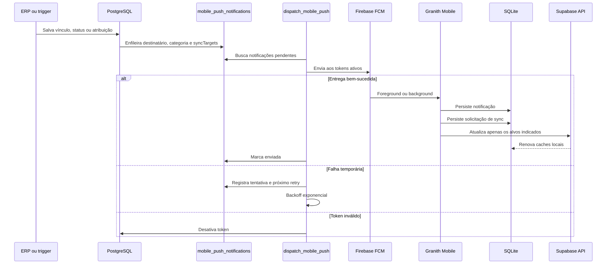

### Eventos que geram push atualmente

| Evento | Destinatário principal | Alvos de sincronização |
| --- | --- | --- |
| Coordenador adicionado/removido da obra | Coordenador antigo/novo | `auth`, `workspace`, `projects`, `teams` |
| Equipe vinculada à obra | Membros relacionados | `workspace`, `projects`, `teams` |
| Benefício alterado | Funcionário | `workspace`, `benefits`, `profile` |
| Requisição ou status de material | Solicitante/relacionados | `workspace`, `requisitions`, `purchases` |
| Rota criada ou alterada | Motorista | `workspace`, `routes` |
| Veículo atribuído/removido | Funcionário | `workspace`, `vehicles`, `routes` |
| Cargo, perfil ou permissões alterados | Usuário/funcionário | `auth`, `workspace`, `profile`, `permissions` |
| Nova tarefa ou tarefa alterada | Executor ou supervisor | `tasks` |

Push não é a fonte de verdade. Se a entrega falhar, a informação continua no
Supabase e será obtida pela próxima sincronização.

## 11. Offline first do Mobile

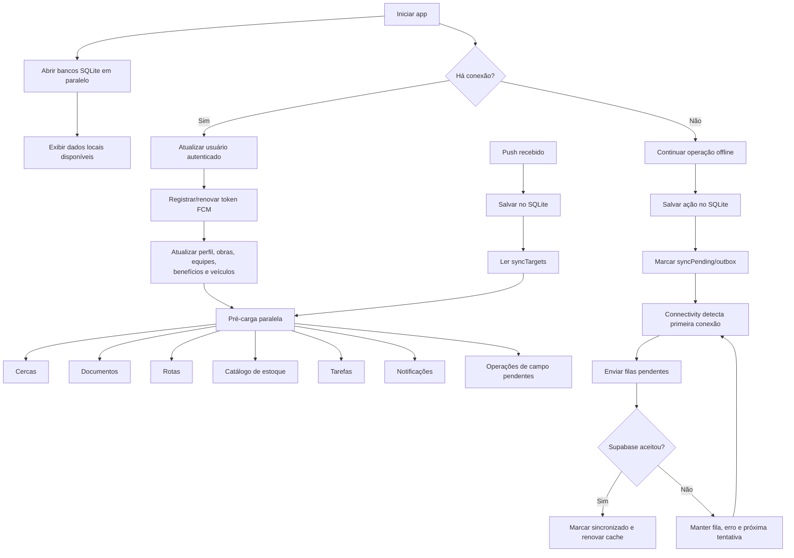

### Bancos locais atuais

| Banco/repositório | Conteúdo |
| --- | --- |
| `WorkerWorkspaceLocalDatabase` | Perfil, obras, equipes, benefícios, veículos e resumo do workspace. |
| `TimeClockLocalDatabase` | Ponto, eventos e fila de sincronização. |
| `DriverRouteLocalDatabase` | Rotas, paradas, tracking e checkpoints. |
| `FieldOperationLocalDatabase` | Evidências, operações de estoque, veículo e campo. |
| `MobileInventoryCatalogLocalDatabase` | Catálogo usado para requisições e estoque. |
| `GranithTaskLocalDatabase` | Tarefas, pessoas, referências e `task_outbox`. |
| Banco de notificações | Notificações recebidas e solicitações pendentes de sync. |

## 12. Inteligência artificial

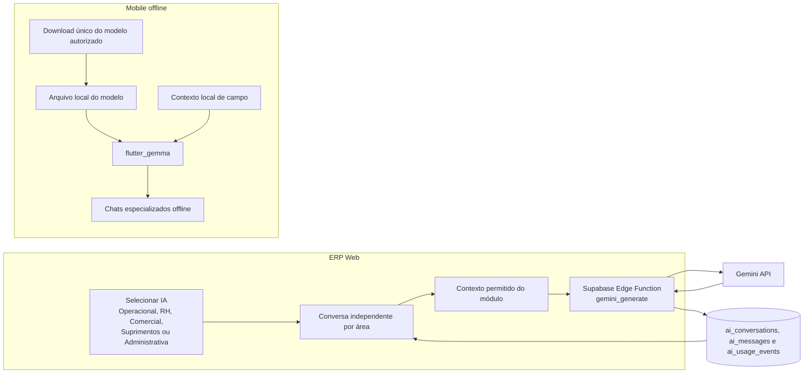

No ERP, a chave Gemini fica na Edge Function e não é enviada ao navegador. No
Mobile, o Hugging Face é usado para baixar o arquivo autorizado; a inferência
acontece localmente com `flutter_gemma`.

## 13. Modelo relacional resumido

```mermaid
erDiagram
  USERS }o--o| EMPLOYEES : "vincula funcionário"
  USERS }o--o| CLIENT_ACCOUNTS : "vincula cliente"
  CLIENT_ACCOUNTS ||--o{ BUDGETS : "recebe orçamento"
  CLIENT_ACCOUNTS ||--o{ PROJECTS : "possui obra"
  BUDGET_TYPES ||--o{ BUDGETS : "classifica"
  BUDGETS |o--o| PROJECTS : "aprovação origina"

  JOB_ROLES ||--o{ EMPLOYEES : "define cargo"
  EMPLOYEES ||--o{ EMPLOYEE_BENEFITS : "recebe"
  BENEFITS ||--o{ EMPLOYEE_BENEFITS : "é atribuído"
  EMPLOYEES ||--o{ SALARY_HISTORY : "possui histórico"
  EMPLOYEES ||--o{ TEAMS : "lidera"
  PROJECTS ||--o{ TEAMS : "recebe equipe"
  EMPLOYEES ||--o{ VEHICLES : "recebe veículo"

  PROJECTS ||--o{ PROJECT_MEASUREMENTS : "possui"
  PROJECTS ||--o{ DAILY_LOGS : "possui"
  PROJECTS ||--o{ MATERIAL_REQUISITIONS : "demanda"
  PROJECTS ||--o{ FINANCIAL_TRANSACTIONS : "classifica"
  PROJECTS ||--o{ INVENTORY_MOVEMENTS : "consome"
  PROJECTS ||--o{ GRANITH_TASKS : "origina"
  BUDGETS ||--o{ GRANITH_TASKS : "origina"

  MATERIAL_REQUISITIONS ||--o{ MATERIAL_REQUISITION_SUPPLIER_QUOTES : "recebe"
  SUPPLIERS ||--o{ MATERIAL_REQUISITION_SUPPLIER_QUOTES : "responde"
  MATERIAL_REQUISITIONS ||--o{ PURCHASES : "gera"
  SUPPLIERS ||--o{ PURCHASES : "fornece"
  PURCHASES ||--o| FINANCIAL_TRANSACTIONS : "gera conta"
  PURCHASES ||--o{ INVENTORY_MOVEMENTS : "gera entrada"
  INVENTORY ||--o{ INVENTORY_MOVEMENTS : "movimenta"

  EMPLOYEES ||--o{ PURCHASE_DELIVERY_ROUTES : "dirige"
  PURCHASE_DELIVERY_ROUTES ||--o{ PURCHASE_DELIVERY_ROUTE_STOPS : "contém"
  PURCHASES ||--o{ PURCHASE_DELIVERY_ROUTE_STOPS : "vira parada"
  PURCHASE_DELIVERY_ROUTES ||--o{ PURCHASE_DELIVERY_ROUTE_TRACKING_POINTS : "registra"

  EMPLOYEES ||--o{ TIME_CLOCK_AFD_EVENTS : "marca ponto"
  PROJECTS ||--o{ TIME_CLOCK_AFD_EVENTS : "localiza"
  EMPLOYEES ||--o{ MOBILE_WORK_HOUR_ENTRIES : "aponta horas"
  PROJECTS ||--o{ MOBILE_WORK_HOUR_ENTRIES : "recebe horas"

  EMPLOYEES ||--o{ GRANITH_TASKS : "supervisiona/executa"
  GRANITH_TASKS ||--o{ GRANITH_TASK_TIME_ENTRIES : "acumula"
  EMPLOYEES ||--o{ GRANITH_TASK_TIME_ENTRIES : "trabalha"

  USERS ||--o{ MOBILE_DEVICE_TOKENS : "registra aparelho"
  EMPLOYEES ||--o{ MOBILE_DEVICE_TOKENS : "recebe push"
  USERS ||--o{ MOBILE_PUSH_NOTIFICATIONS : "recebe"
```

## 14. Matriz de herança de dados

| Entidade principal | Entidades dependentes | O que é herdado/referenciado |
| --- | --- | --- |
| `users` | sessão, RLS, token FCM, conversas de IA | UID, e-mail, papel, permissões e vínculos. |
| `employees` | equipes, benefícios, veículos, rotas, tarefas, ponto | ID do funcionário, nome histórico e papel hierárquico. |
| `client_accounts` | orçamentos, projetos e portal | Conta usada para limitar o que o cliente pode consultar. |
| `budgets` | projetos e tarefas | Um orçamento aprovado pode criar a obra e mantém `projectId`. |
| `projects` | equipe, cerca, medições, diário, requisição, compra, tarefa, ponto e finanças | Identidade da obra e nome denormalizado para histórico. |
| `material_requisitions` | cotações e compras | Origem da necessidade, itens e status consolidado. |
| `purchases` | contas a pagar, paradas de rota, estoque e requisição | Fornecedor, obra, valores, entrega e situação. |
| `purchase_delivery_routes` | paradas e tracking | Motorista, agenda, status, KM e bônus. |
| `granith_tasks` | entradas de tempo | Executor, supervisor, origem e cronômetro persistente. |
| `time_clock_afd_events` | análise de mão de obra | Marcações imutáveis usadas para formar jornadas e custos. |

## 15. O que é manual e o que o sistema propaga

| Ação inicial | Propagação atual |
| --- | --- |
| Aprovar orçamento | Cria/reutiliza projeto e vincula o orçamento ao projeto. |
| Alterar coordenador da obra | Atualiza projeto, gera push e solicita sync do workspace. |
| Vincular equipe à obra | Torna a obra visível à equipe e gera evento de atualização. |
| Atribuir benefício | Atualiza RH e notifica o funcionário. |
| Atribuir veículo ativo | Torna o funcionário elegível como motorista e atualiza o Mobile. |
| Selecionar cotação | Gera pedido(s) aguardando aprovação e marca a requisição como comprada. |
| Consolidar compra | Cria/garante o contas a pagar. |
| Confirmar entrega | Atualiza compra, estoque e movimento; trigger fecha a requisição quando aplicável. |
| Iniciar tarefa | Servidor abre uma entrada de tempo; o relógio independe do cliente aberto. |
| Salvar no ERP | Service emite escopos no `AppDataRefreshBus` para recarregar telas relacionadas. |
| Receber push no Mobile | Salva localmente e sincroniza apenas os alvos do evento. |
| Trabalhar offline | Persiste localmente e envia na primeira conexão disponível. |

## 16. Pontos importantes encontrados no estado atual

1. **Diretoria não é um papel persistido em `employees`.** O enum Mobile possui
   `diretoria`, mas a constraint do banco aceita apenas `funcionario`,
   `supervisor`, `coordenador` e `gerente`. O rank 5 é concedido a `users.role =
   admin`.
2. **O vínculo usuário → funcionário está em transição.** Os fluxos novos usam
   `employee_id`/`employeeId` e fallback por e-mail. Algumas funções RLS mais
   antigas ainda resolvem o funcionário diretamente pelo e-mail do JWT.
3. **Coordenador não é `NOT NULL` no banco.** O formulário manual exige o
   coordenador, porém um projeto criado pela aprovação do orçamento pode passar
   por um caminho diferente. A regra “toda obra nasce com coordenador” ainda não
   está garantida por constraint.
4. **Estoque não reserva requisição automaticamente.** O item pode apontar para
   catálogo/estoque e uma baixa pode ser feita para a obra, mas não há hoje uma
   reserva automática nem um trigger que encerre a requisição por essa baixa.
5. **Medição atualiza progresso e indicadores, mas não cria sozinha uma receita
   financeira.** A relação com o financeiro é de análise/visão gerencial no
   service auditado.
6. **Nomes são parcialmente denormalizados.** Tabelas guardam IDs e também
   campos como `projectName`, `employeeName` e `supplierName`; isso preserva
   contexto histórico, mas alterações no cadastro principal não necessariamente
   renomeiam todo o histórico.
7. **Firebase não é o banco operacional.** Dados de negócio estão no Supabase;
   Firebase permanece para Hosting e FCM.

## 17. Checklist para comparar com outro diagrama

Ao receber o seu diagrama, a comparação deve responder:

- Ele coloca o Supabase como fonte de verdade?
- Separa planejamento/gestão no ERP de execução de campo no Mobile?
- Mostra `users` separado de `employees` e `client_accounts`?
- Representa a hierarquia cumulativa e as permissões específicas?
- Orçamento aprovado gera projeto?
- Projeto concentra coordenador, equipe, cerca e operações da obra?
- Requisição passa por cotação, pedido, aprovação, consolidação e entrega?
- Compra consolidada gera contas a pagar?
- Entrega alimenta estoque e pode fechar a requisição?
- Veículo ativo vinculado ao funcionário define o motorista?
- ERP planeja rota e Mobile executa/tracking?
- Ponto nasce no Mobile e a análise de custo fica no ERP?
- Tarefas usam timestamp/RPC do servidor e não cronômetro volátil?
- Push apenas acorda/sincroniza, sem substituir o banco?
- Mobile mantém cache e outbox no SQLite?
- Gemini do ERP passa pela Edge Function?
- IA do Mobile executa localmente após o download do modelo?

## 18. Fontes usadas para este mapa

Principais pontos de validação:

- `lib/screens/main_layout.dart`
- `lib/app/routing/app_router.dart`
- `lib/services/`
- `lib/core/data/app_data_refresh_bus.dart`
- `supabase/migrations/20260503100000_base_schema.sql`
- `supabase/migrations/20260503200000_enable_rls_security_baseline.sql`
- `supabase/migrations/20260504143000_mobile_role_hierarchy.sql`
- `supabase/migrations/20260509160000_add_purchase_logistics_and_requisition_quotes.sql`
- `supabase/migrations/20260515110000_add_mobile_notification_events.sql`
- `supabase/migrations/20260515123000_mobile_push_sync_requests.sql`
- `supabase/migrations/20260708150000_add_mobile_vehicle_purchase_sync.sql`
- `supabase/migrations/20260727120000_add_shared_tasks_module.sql`
- Mobile: `lib/core/services/mobile_startup_sync_service.dart`
- Mobile: `lib/core/services/mobile_notification_service.dart`
- Mobile: `lib/core/services/location_background_service.dart`
- Mobile: `lib/features/**/data/`

